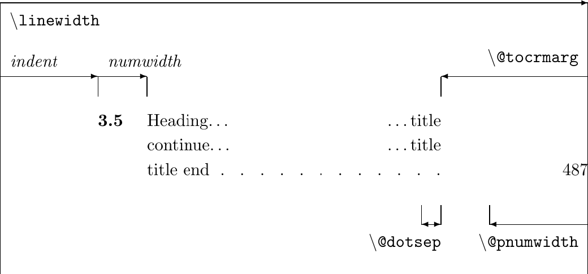

#### Add prefix for title in the TOC, LOT, LOF
- By default the latex `TOC` do not has a prefix for each level section, so it only printable `Latin I, II,... for part` or `1,2,3... for chapter` or lower section level.
- Method is use package [tocloft]
    ```bash
        sudo tlmgr install tocloft

        # check
        tlmgr list --list --only-installed tocloft 

        # return
        doc files:
            texmf-dist/doc/latex/tocloft/README details="Readme"
            texmf-dist/doc/latex/tocloft/tocloft.pdf details="Package documentation"
    ```
- Note that by default LaTeX put TOC, LOT, LOF in new page but `tocloft` will disable and we has to do by hand `\newpage` or `\clearpage`

##### 1. set page style for TOC, LOT, LOF
```latex
    % preamble
    \usepackage{tocloft}

    % before TOC, LOT, LOF
    \tocloftpagestyle{〈style〉}
```
- By default `style` is `plain`, other is `heading`, `empty`. It similar with [`\pagestyle`](../_200_LaTeX_wikibook/_207_page_layout.md#topic)
- The `TOC` structure like below, LOT and LOF is similar:
    

##### 2. Command
1. Set dots
    - `\renewcommand{\cftdot}{.}`: by defaut the line `.` is buffer between title and page number.
    - `\cftnodots`: disable dots buffer
    - `\renewcommand{\cftdotsep}{width}` adjust distance of dots.
        - `width` is a scale factor, no unit.
        - `\cftnodots` is macro return 5000, this value completely like no dot.
2. Set page number align
    - `\cftsetpnumwidth{length}` see `ToC` structure above, it is limit for write page number.
    - `\cftsetrmarg{length}` is limit of minimum space between title and right edge.
        - Note: if `\cftsetpnumwidth` >= `\cftsetrmarg`, when title reach limit it can overwrite on page number.
    - `\renewcommand{\cftpnumalign}{aligh}`, aligh here can be `l` `c` `r`. This method set align for page number
        - Default is `r` right

3. Set length for title:
- Note: `X` maybe: part, chap, sec, subsec, subsubsec, para, subpara, fig, subfig, tab, subtan.
- `\setlength{\cftbeforXskip}{pt/cm/...}` vertical space before entry
- `\setlength{\cftXindent}{pt/cm/...}` set indent 