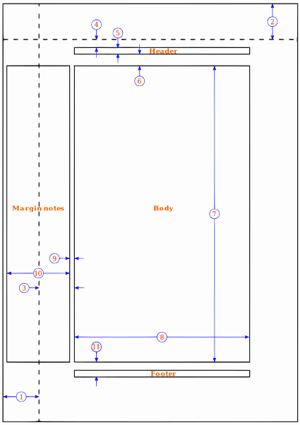

## Refer wifi book page 194

- (1) == one inch + \hoffset
    - default \hoffset = 0pt
- (2) == one inch + \voffset
    - default \voffset = 0pt
- (3) == \oddsidemargin
    - or with twoside need both \oddsidemargin for odd page (right) and \evensidemargin even page (left page)
    - Purpose of these margin is the `1inch` is origin spine of book, but at the moment we can adjust a spine shorter by set `oddsisemargin` opposite or wider by positive value
- (4) == \topmargin
    - Set by:
        - `\usepackage[a4paper,top=2cm]{geometry}`
- (5) == \headheight
- (6) == \headsep
- (7) == \textheight
- (8) == \textwidth
- (9) == \marginparsep
- (10)== \marginparwidth
- (11)== \footskip

### some convenient equation:
- Note to `(3)`, by default `oddsizemargin` == `evensidemargin`
    - If adjust one, the `\setlength{\evensidemargin}{\oddsidemargin}` can adjust `evensidemargin` equal `oddsizemargin` or reverse if twoside mode

- This is some special margin wrap main text:
    - the `(8)` is text width
    - the `(7)` is text height
    - the `(2) + (4)` is top text margin
    - the `\paperheight - (2) - (4) - (6) - (7)` is bottom text margin
    - In 2 side mode (oddpage) or 1 side
        - the `\paperwidth - (1) - (3) - (8)` is right text margin
        - the `(1) + (3)` is left text margin
    - In 2 side mode (even page) only
        - the `(1) + (3)` is right text margin
        - the `\paperwidth - (1) - (3) - (8)` is left text margin